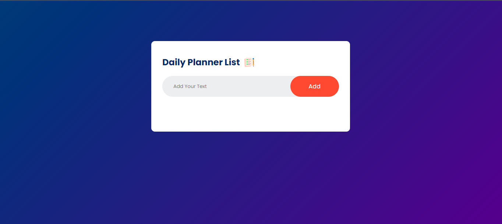
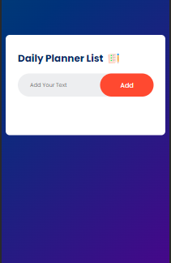
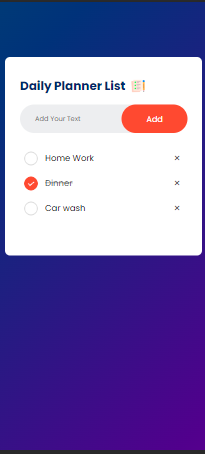
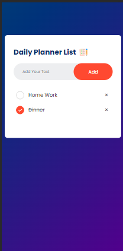
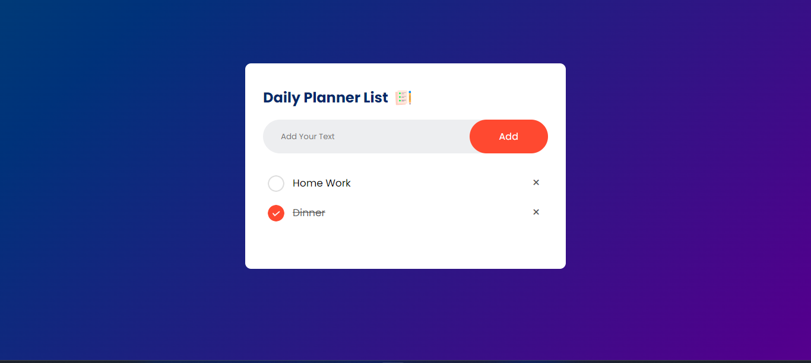
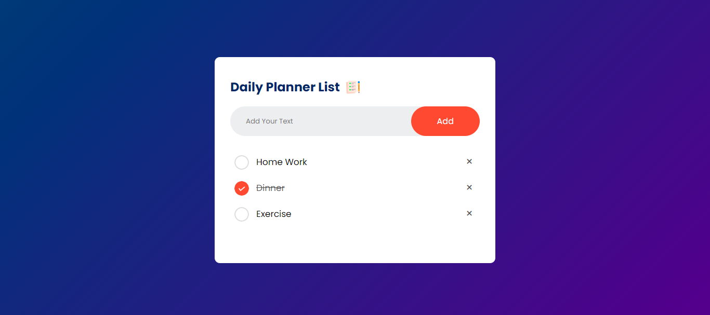

# Getting Started with Daily planner Or Reminder app

<a href="" target="blank">Daily planner Or Reminder app</a>

### " Daily planner Or Reminder app using HTML, CSS &amp; JavaScript"

It's a  Daily planner Or Reminder app made by using HTML, CSS &amp; JavaScript.

The Daily planner Or Reminder app  is created by [Huzaifa Nizam](https://www.linkedin.com/in/huzaifa-nizam-741631264) 

## Show some :heart: and :star: the repo if you like the design.

- 📫 How to reach me **nizamhuzaifa@gmail.com**

<h3 align="left">Connect with me:</h3>

git init
git add README.md
git commit -m "first commit"
git branch -M main
git remote add origin https://github.com/huzaifanizam/Daily_planner-Or-Reminders.git
git push -u origin main